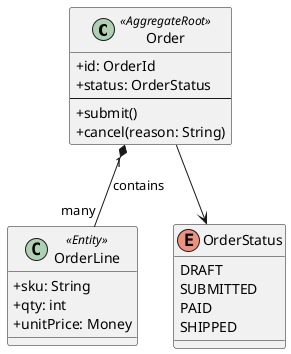
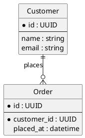
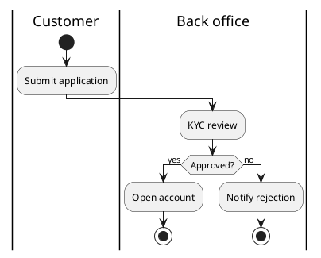
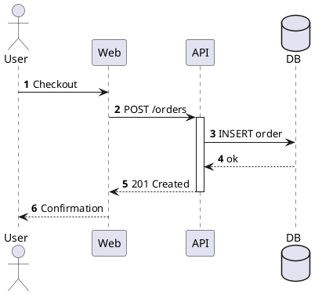
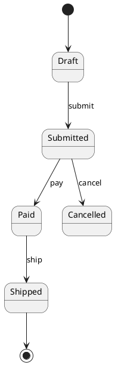

# PlantUML skill

PlantUML is the **primary diagram language** for architecture, analysis, and flows in Cow Eve. The LLM never outputs pixels: you write **text** (`.puml`), the UI renders SVG (Kroki). Your job is **correct syntax**, the right **diagram type**, and **one clear diagram per file** unless the user asks for a bundle.

## When to activate

| User intent | Diagram family |
|-------------|----------------|
| System landscape, context, “who talks to what” | **C4 Context** |
| Application / service breakdown, APIs, data stores | **C4 Container** |
| Modules inside one app, layers, packages | **C4 Component** |
| Infra, K8s, regions, VPC, deployment | **C4 Deployment** |
| Request path through containers over time | **C4 Dynamic** |
| Domain model, entities, aggregates, value objects | **Class** (+ notes / packages) |
| ER / data dictionary | **Entity-relationship** (`entity`) |
| Business process, approval, user journey | **Activity** (partition / swimlane) |
| Code path, API call chain, async handoff | **Sequence** |
| State machine, lifecycle | **State** |
| Org, ownership | **Deployment** (org chart) or **WBS** |
| Roadmap | **Gantt** |
| Mind map, brainstorming | **Mindmap** |
| Network topology | **Network** (`nwdiag`) |
| Simple decision tree | **Activity** or **Graphviz** (`@startdot`) — prefer Activity for LLM reliability |

If the user says “架构图” without level, **ask or infer**: Context (stakeholders + systems) → Container (apps/DB/queues) → Component (inside one system) → Deployment (where it runs). Do not cram all C4 levels into one diagram.

## Delivery workflow (mandatory)

1. **`load_skill` for `plantuml`** before writing non-trivial diagrams.
2. Clarify **scope** (one diagram, one level, one scenario) if ambiguous.
3. Write **`@startuml` … `@enduml`** in the sandbox, e.g. `/workspace/content-studio/<topic>-<type>.puml`.
4. **Self-check syntax** using [Pre-publish checklist](#pre-publish-checklist) below.
5. Optional: if `plantuml` CLI exists in sandbox, run `plantuml -checkonly -nometadata <file.puml>`; fix errors before publish.
6. **`publish`** the `.puml` path with a short English or Chinese title matching the diagram.
7. Reply with a **short narrative** (what the diagram shows, key decisions). Do **not** substitute markdown-only diagrams for `publish`.

**Rules**

- **Always publish `.puml` source** for PlantUML requests. PNG from local render is optional extra, not a replacement.
- **One main diagram per file** for preview reliability. Use separate files for Context vs Container vs Deployment.
- **Aliases ASCII only** (`orderSvc`, `userDb`). **Labels** may be Chinese: `System(orderSvc, "订单服务", "Handles order API")`.
- Prefer **C4-PlantUML stdlib includes over HTTPS** (works with Kroki preview). Do not paste entire C4 library into the file.

---

## C4 model (learn this deeply)

C4 separates **static structure** (Context, Container, Component, Deployment) from **behavior** (Dynamic, Sequence). Use [C4-PlantUML](https://github.com/plantuml-stdlib/C4-PlantUML) macros—do not hand-draw boxes that look like C4 but use wrong syntax.

### Includes (put immediately after `@startuml`)

| Level | Include line |
|-------|----------------|
| Context / Landscape | `!include https://raw.githubusercontent.com/plantuml-stdlib/C4-PlantUML/master/C4_Context.puml` |
| Container | `!include https://raw.githubusercontent.com/plantuml-stdlib/C4-PlantUML/master/C4_Container.puml` |
| Component | `!include https://raw.githubusercontent.com/plantuml-stdlib/C4-PlantUML/master/C4_Component.puml` |
| Deployment | `!include https://raw.githubusercontent.com/plantuml-stdlib/C4-PlantUML/master/C4_Deployment.puml` |
| Dynamic (interactions) | `!include https://raw.githubusercontent.com/plantuml-stdlib/C4-PlantUML/master/C4_Dynamic.puml` |

Container include pulls Context; Component include pulls Container; Deployment include pulls Container. **Use the shallowest include that matches the diagram level** (don’t include Component if you only need Context).

### Core elements (Container level and below)

- **People:** `Person`, `Person_Ext`
- **Systems:** `System`, `System_Ext`, `SystemDb`, `SystemQueue` (+ `_Ext` variants)
- **Containers:** `Container`, `ContainerDb`, `ContainerQueue`, `Container_Ext`, …
- **Components:** `Component`, `ComponentDb`, `ComponentQueue`, …
- **Boundaries:** `Enterprise_Boundary`, `System_Boundary`, `Container_Boundary`, `Boundary`
- **Relationships:** `Rel(from, to, "Label", "Technology")`, `BiRel`, `Rel_U`, `Rel_D`, `Rel_L`, `Rel_R`, `Rel_Back`

**Technology** is the 4th argument on `Rel` (e.g. `"HTTPS"`, `"JSON/REST"`, `"gRPC"`, `"JDBC"`). Keep labels short; put detail in `descr` on elements when needed.

### Diagram types in practice

| Diagram | Purpose | Typical elements |
|---------|---------|------------------|
| **System Context** | One product in its world | 1 `System` + `Person` + external `System_Ext` |
| **System Landscape** | Multiple products | Several `System` inside `Enterprise_Boundary` |
| **Container** | Apps, APIs, DB, queues inside one system | `System_Boundary` → `Container` / `ContainerDb` / `ContainerQueue` |
| **Component** | Inside one container | `Container_Boundary` → `Component` |
| **Deployment** | Where containers run | `Deployment_Node` / `Node` nesting; place `Container(...)` inside nodes |
| **Dynamic** | Single scenario across containers | Same as Container + `RelIndex` ordering or Dynamic-specific rel macros |

### C4 Context example (minimal, valid)

```plantuml
@startuml c4-context-example
!include https://raw.githubusercontent.com/plantuml-stdlib/C4-PlantUML/master/C4_Context.puml

LAYOUT_WITH_LEGEND()

Person(customer, "Customer", "Uses the web app")
System(shop, "Online Shop", "Browse and buy")
System_Ext(pay, "Payment Provider", "Card processing")

Rel(customer, shop, "Uses", "HTTPS")
Rel(shop, pay, "Charges", "HTTPS/API")

@enduml
```

### C4 Container example

```plantuml
@startuml c4-container-example
!include https://raw.githubusercontent.com/plantuml-stdlib/C4-PlantUML/master/C4_Container.puml

LAYOUT_WITH_LEGEND()

Person(user, "User")

System_Boundary(shop, "Online Shop") {
  Container(web, "Web App", "React", "UI")
  Container(api, "API", "Node.js", "REST")
  ContainerDb(db, "Database", "PostgreSQL", "Orders & catalog")
}

Rel(user, web, "Uses", "HTTPS")
Rel(web, api, "Calls", "JSON/HTTPS")
Rel(api, db, "Reads/Writes", "SQL/TCP")

@enduml
```

### C4 Deployment example

```plantuml
@startuml c4-deployment-example
!include https://raw.githubusercontent.com/plantuml-stdlib/C4-PlantUML/master/C4_Deployment.puml

Deployment_Node(cloud, "Production", "AWS") {
  Deployment_Node(eks, "EKS Cluster", "Kubernetes") {
    Container(api, "API Pods", "Go", "Horizontally scaled")
  }
  Deployment_Node(rds, "RDS", "AWS RDS") {
    ContainerDb(db, "PostgreSQL", "Primary DB")
  }
}

Rel(api, db, "JDBC", "TLS")

@enduml
```

### C4 pitfalls (LLMs fail here often)

- **Undefined alias in `Rel`:** every `from` / `to` must match an earlier `Person` / `System` / `Container` / `Component` / `Deployment_Node` alias exactly (case-sensitive).
- **Wrong include:** Component macros on a Context-only include → parse errors. Match include to diagram level.
- **Commas inside labels:** wrap label in double quotes: `"Order, Fulfillment"`. Do not use smart quotes `"` `"`.
- **Nesting braces:** every `{` must close before `@enduml`. One boundary at a time when learning; avoid 5-level nesting in one file.
- **`title` vs diagram name:** `@startuml my-id` is fine; optional `title My Title` after includes.
- **Do not mix** classic PlantUML `rectangle`/`component` with C4 macros in the same diagram unless you know what you are doing.

---

## Object and domain analysis

### Class diagrams (DDD-friendly)

Use for **domain objects**, **aggregates**, **value objects**, **services**, **enums**.



**Conventions**

- `<<AggregateRoot>>`, `<<Entity>>`, `<<ValueObject>>` stereotypes via `<<...>>` on class line.
- **Associations:** `"1" *-- "many"` composition; `"1" o-- "many"` aggregation; `-->` dependency.
- **Methods** use `+`/`-` visibility; **attributes** `name: Type`.
- Split large models: **one bounded context per file** (e.g. `billing-domain.puml`, `catalog-domain.puml`).

### Entity-relationship (data-focused)



Use `*` for PK/FK markers in field list; `||--o{`, `}|--||`, etc. for cardinality.

---

## Process and flow analysis

### Activity (business process, swimlanes)

Best for **业务流程**, approvals, branches, parallel work.



**Rules:** `start` / `stop` / `end`; `if () then () else () endif`; partitions `|Lane|`; use `:Label;` (semicolon ends action). Avoid `:Label` without semicolon on same line confusion—prefer one action per line.

### Sequence (code / API / message flow)

Best for **时序**, **调用链**, **同步/异步**.



**Rules:** declare `participant` / `actor` / `database` before use; **`activate` / `deactivate` must pair**; use `->` sync, `-->` return/dashed; `autonumber` optional; avoid `alt`/`else`/`end` mismatch—each `alt` needs `end`.

### State (lifecycle)



### C4 Dynamic (architecture behavior)

When the user wants **“请求怎么走”** at container level, use **C4_Dynamic** with the same containers as the static Container diagram, plus ordered interactions (see C4-PlantUML README for `RelIndex` / dynamic rel helpers).

---

## Other PlantUML types (short guide)

| Type | `@start…` | Notes |
|------|-----------|--------|
| Use case | `@startuml` + `(Use Case)` | Good for scope boundaries; keep ≤10 cases |
| Component (UML) | `component`, `interface` | Legacy UML; prefer C4 Component for software arch |
| Package | `package` + classes | Group domain classes |
| Timing | `concise`, `robust` | Rare; verify syntax in docs before use |
| Gantt | `@startgantt` | Dates `YYYY-MM-DD`; project for phases |
| Mindmap | `@startmindmap` | Indented `*` levels |
| WBS | `@startwbs` | Work breakdown |
| JSON / YAML | `@startjson` / `@startyaml` | Data structure viz, not architecture |
| Salt (UI wireframe) | `@startsalt` | Low-fi UI; easy to break—keep tiny |

Default to **Activity / Sequence / Class / C4** unless the user names another type.

---

## Syntax reliability (read before every publish)

External editors and LLMs often ship **almost valid** PlantUML. Follow these rules to stay parse-clean on Kroki and CLI.

### Universal

1. **Wrap every diagram** in `@startuml` and `@enduml` (or `@startgantt` / `@endgantt`, etc.—matching pairs only).
2. **ASCII aliases** for identifiers; **quoted strings** for human labels with spaces or commas.
3. **No Markdown** inside `.puml` files: no `# heading`, no fenced code blocks, no backticks.
4. **No smart quotes** `“”` `‘’`; use straight `"` `'`.
5. **Comments:** `/' block '/` or single-quote line `'` — avoid unclosed `'/`.
6. **One diagram per file** for Cow Eve preview unless user explicitly wants multi-page (`newpage` is fragile in preview).

### C4-specific

7. **Include URL exactly** as shown (master branch raw GitHub). No local `!include ./C4_...` unless files exist in sandbox.
8. **`Rel(a,b,...)`:** `a` and `b` are **aliases**, not display names.
9. Optional layout: `LAYOUT_TOP_DOWN()`, `LAYOUT_LEFT_RIGHT()`, `LAYOUT_WITH_LEGEND()` after includes—pick one layout directive.

### Activity / Sequence / Class

10. **Activity:** every `if` has `endif`; every `while` has `endwhile`; `stop` or `end` explicitly.
11. **Sequence:** every `alt`, `opt`, `loop`, `par` closed with `end`.
12. **Class:** `{` / `}` balanced; enum separate block; avoid `{abstract}` unless you know PlantUML class syntax.

### When diagrams fail preview

- Strip experimental features (`!pragma`, custom themes) and re-add one at a time.
- Reduce diagram size (≤15 nodes per view); split into linked files the user can open together.
- For C4, verify **include matches level** and **no orphan Rel**.

---

## Pre-publish checklist

Before **`publish`**, mentally verify:

- [ ] `@startuml` / `@enduml` present and single primary diagram
- [ ] C4: correct `!include` for level; all `Rel` aliases defined
- [ ] No Markdown / smart quotes / backticks in file
- [ ] Chinese allowed in **quoted labels**, not in aliases
- [ ] Filename reflects content: `shop-c4-container.puml`, `order-domain-class.puml`, `checkout-seq.puml`
- [ ] Title passed to `publish` matches diagram purpose

---

## Naming and file layout (sandbox)

| Pattern | Example |
|---------|---------|
| C4 context | `/workspace/content-studio/acme-c4-context.puml` |
| C4 container | `/workspace/content-studio/acme-c4-container.puml` |
| C4 deployment | `/workspace/content-studio/acme-c4-deployment-prod.puml` |
| Domain model | `/workspace/content-studio/billing-domain-class.puml` |
| Business flow | `/workspace/content-studio/kyc-process-activity.puml` |
| API flow | `/workspace/content-studio/payment-capture-sequence.puml` |

---

## References (read when stuck)

- C4-PlantUML macros and samples: https://github.com/plantuml-stdlib/C4-PlantUML/blob/master/README.md
- C4 model book summary (levels): https://c4model.com/
- PlantUML language guide: https://plantuml.com/guide
- Activity: https://plantuml.com/activity-diagram-beta
- Sequence: https://plantuml.com/sequence-diagram
- Class: https://plantuml.com/class-diagram

When a diagram type is unfamiliar, **open the official page**, copy the minimal template, then adapt—do not invent syntax from memory.
